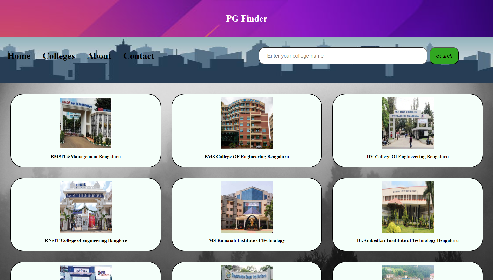
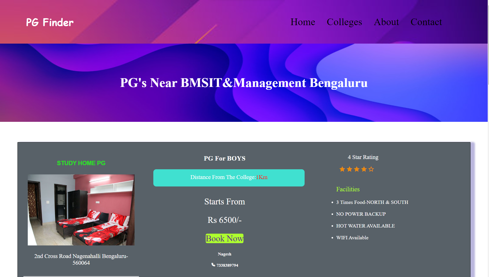

# PG Finder-A complete platform for students to search for PG's

Finding accomodation for a student is a time taking and tiring process. The main goal of this project is to provide a platform were student can get an effective information about all the Hostel and PG's and other accommodation facilities near their college. Currently this website is limited to some colleges. Here the booking details are only sent to admin. This website needs further development for all functionality.
Front end: HTML, CSS, Bootstrap,
Back end: php connect with database. 
Database: mysql 

## Deployment
This website is already deployed in the live serever using Infinity Free web hosting platform.

Website Link: https://pglocatorbykiran.epizy.com/

## Screenshots
</img>

</img>

</img>

</img>
